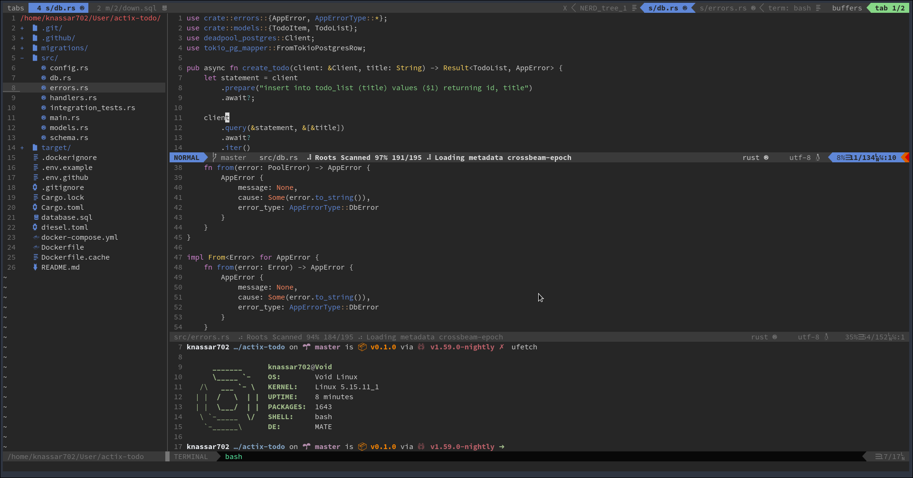
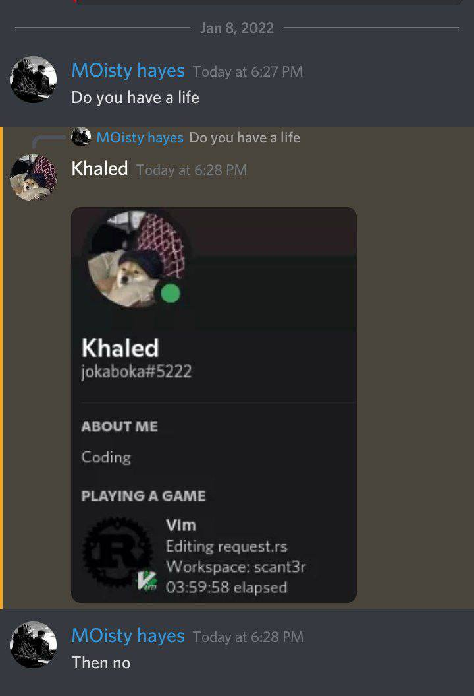

# my VIMRC

install vim-plug and open vim and run `:PlugInstall` and restart vim

* Auto Complete
* ColorScheme
* Discord Status
* Markdown Live Edite
* Files Tree
* Tabs
* Async Run
* Git
* HTTP Client
* bruuh this like VSCODE
